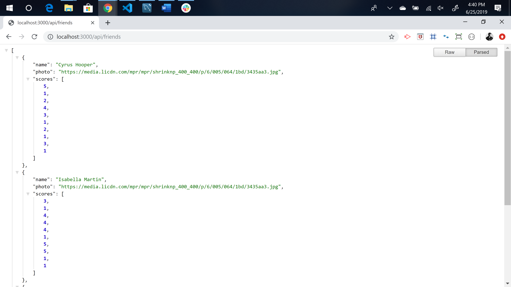

# FriendFinder
Homework week-13

The FriendFinder app is a basic dating app. It's a full-stack site that will take in user inputs from a survey and then compare their answers with other users. Then the app will display the results: name and picture of the user with the best overall match. 

Heroku deployed app link: https://still-coast-70044.herokuapp.com/ 

Issues: 
1.) Having trouble with deploying app to Heroku. 
2.) App is not displaying the modal with best match data. 

Home page displays.

Survey page displays.

Input form fields and questions function.

If all fields are not filled out alert displays. 

api/friends displays when clicked on link, link to github repo works as well. 

Tech Used: 

    1. Node.js 
    2. Express.js 
    3. Heroku
    4. Node_Modules: express, path. 

Built With: 

    VS Code 

Authors: 

    Ryan Fogle 

